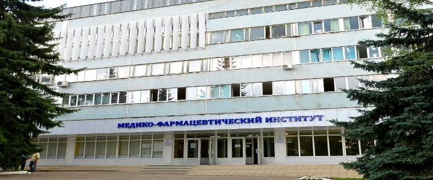

  

* In 2003 I graduated from State Pharmaceutical Academy in Russia. Russian pharmaceutical education is quite different from Western one, it is more about Pharmacology, Statistics, drug development and experimental design than Pharmacy itself. So I received a lot of training in Math, Chemistry and Biology. In the year 2000 I started working for my family's business - pharmacy chain "Rostov Green Pharmacy" - three years before graduating.  
* From Grade 6 programming and hardware administration were my hobbies, so when I worked in our pharmacies a good part of my job was all about computers, I installed, tuned and fixed computers and programs. Administered local networks of computers, printers and modems. At that time I got my first experience with object oriented language. 1C Company supplied us with 1C:Bookkeeping - bookkeeping and documenting software with embedded 1C:Enterprise embedded programming language. My job was creating and editing forms, bills of sale, invoices and many other documents and interactive tools. I worked there for thirteen years till I moved to Canada in 2013.  
* In 2013 Oleg Roderick, a bright mathematician and a head of research, told me about R language and Facebook data tools which made me very curious about Data Science. Since then I have been learning on Coursera. At first R was a hobby for me but with time I developed my R skills to a level that let me be admitted to Calgary Metabolomics Research Facility at the University of Calgary as a volunteer. Half a year later I was offered a position of Research Programmer. My domain knowledge of Microbiology and Biochemistry was of good help.  
* In 2016 my friend and I created a small startup for automatisation of agriculture. Inicially I did almost everything - worked with Arduino and Raspberry Pi, sensors and pumps, made a minimum viable product with one tomato plant and so on. Finally my role narrowed to Machine Learning part. Using Python and Tensorflow I developed and trained a model for recognition of pests and diseases of plants by camera shots and video. My model recognizes five diseases from evaluation part of dataset with 95% accuracy which is great but much more job is waiting to be done.  
* Now I am back to the good old R where I have most of my skills. 
